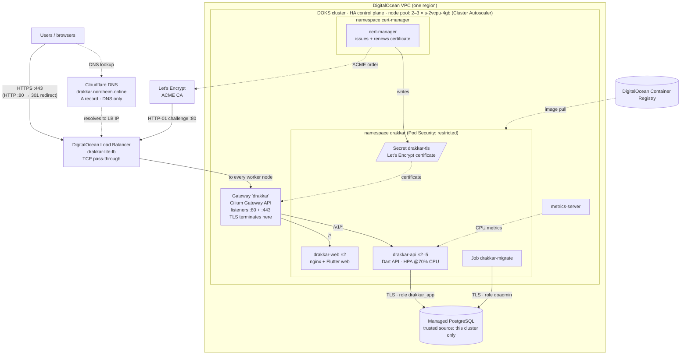

# Drakkar Lite on DigitalOcean Kubernetes (DOKS)

A small multi-tenant SaaS web app (organization sign-up, sign-in, and a searchable contacts directory with an audit log), deployed on **DigitalOcean Kubernetes** with:

- **Docker** images for the API (Dart, AOT-compiled, `scratch` base) and the web client (Flutter web on nginx-unprivileged)
- **DigitalOcean Load Balancer**, created by a Kubernetes **Gateway** (Cilium Gateway API)
- **Horizontal Pod Autoscaler** on CPU (2–5 API pods) and the **Cluster Autoscaler** on the node pool (2–3 nodes)
- **DigitalOcean Managed PostgreSQL** over the private VPC, with TLS and Row-Level Security for tenant isolation
- Zero-downtime rolling updates, PodDisruptionBudgets, health probes, and restricted Pod Security
- **HTTPS** with a free Let's Encrypt certificate issued and renewed by **cert-manager**; TLS terminates at the Gateway, and HTTP redirects to HTTPS

Live at **https://drakkar.nordheim.online**.

**Documents:** [Setup guide](docs/SETUP_GUIDE.md) · [Cost analysis](docs/COST_ANALYSIS.md) · [QBR](docs/QBR.md) · [Architecture diagram](docs/architecture.png) ([SVG](docs/architecture.svg), [Mermaid source](docs/architecture.mmd)) · [Test evidence](docs/results/)

Author: Chuck Talk · Built for the DigitalOcean TAM case study.

---

## Architecture



| Path | Goes to | Why |
|---|---|---|
| `/v1/...` | `drakkar-api` Service | JSON API (longest-prefix match wins) |
| everything else | `drakkar-web` Service | Flutter web app, same origin, so no CORS |
| `/healthz`, `/readyz`, `/metrics` | not exposed publicly | Probes and Prometheus metrics stay inside the cluster |

HTTPS: `drakkar.nordheim.online` is an A record at Cloudflare (DNS only, not proxied) pointing at the load balancer. The load balancer passes traffic through; the Gateway's `:443` listener terminates TLS with the certificate cert-manager stores in the `drakkar-tls` Secret, and the `:80` listener redirects to HTTPS (it also answers Let's Encrypt's HTTP-01 challenge).

## Repository layout

```
core/              shared Dart: Contact model, password rules, email check
server/            Dart API (shelf + postgres); one image, two commands: `serve` and `migrate`
web/               Flutter web client + nginx image
k8s/               kustomize: namespace, api, web, gateway (load balancer), HPA + PDBs
  migrate/         database migration Job (applied on its own; Jobs are immutable)
  tools/           load-generator Job used by scripts/load.sh
  extras/          Plan B: classic LoadBalancer Service for the web pods
local/initdb/      creates the non-owner app role for docker compose
scripts/           verify_build · set_registry · isolation_demo · rollout_check · load · k6-read.js · collect_evidence · cost_check
docs/              architecture, setup guide, cost analysis, QBR, results/ (performance evidence)
presentation/      submission deck (PDF)
docker-compose.yml local stack that mirrors the cluster layout
```

## Prerequisites

| Tool | Used for |
|---|---|
| Dart 3.5+ and Flutter 3.24+ | build and test |
| Docker with buildx | images (build for `linux/amd64`; DOKS nodes are x86-64) |
| `doctl` (authenticated with `doctl auth init`) | DigitalOcean resources |
| `kubectl` 1.33+ | deploy and operate |
| `k6` (optional) | load testing |

## 1. Build and test locally

```bash
scripts/verify_build.sh          # analyze, test, compile, build web, build both images
E2E=1 scripts/verify_build.sh    # also runs the stack in docker compose and the isolation test
```

Or step by step:

```bash
(cd core   && dart pub get && dart analyze && dart test)
(cd server && dart pub get && dart analyze && dart test)
(cd web && flutter create --platforms=web --project-name drakkar_web . \
        && flutter pub get && flutter analyze && flutter test \
        && flutter build web --release --no-web-resources-cdn)
docker compose up --build        # web: http://localhost:18081   api: http://localhost:18080
scripts/isolation_demo.sh http://localhost:18081
```

(`flutter create .` only adds the missing web scaffold. It doesn't overwrite existing files.)

## 2. Create the DigitalOcean resources

```bash
export REGION=nyc3 REG=<registry-name> CLUSTER=drakkar-demo DB=drakkar-demo-pg

doctl registry create $REG --subscription-tier basic --region $REGION

doctl kubernetes cluster create $CLUSTER --region $REGION --version latest \
  --node-pool "name=default;size=s-2vcpu-4gb;count=2;auto-scale=true;min-nodes=2;max-nodes=3" \
  --1-clicks metrics-server
doctl kubernetes cluster kubeconfig save $CLUSTER
doctl kubernetes cluster registry add $CLUSTER

kubectl get gatewayclass cilium        # ACCEPTED must be True
kubectl top nodes                      # metrics-server is working (may take a few minutes)

doctl databases create $DB --engine pg --region $REGION --size db-s-1vcpu-1gb --num-nodes 1 --wait
DB_ID=$(doctl databases list --format ID,Name --no-header | awk -v n=$DB '$2==n{print $1}')
CLUSTER_ID=$(doctl kubernetes cluster get $CLUSTER --format ID --no-header)
doctl databases db create $DB_ID drakkar
doctl databases user create $DB_ID drakkar_app
doctl databases firewalls append $DB_ID --rule k8s:$CLUSTER_ID
doctl databases connection $DB_ID --private --format Host,Port,User,Password   # or console: Connection details → VPC network
doctl databases user get $DB_ID drakkar_app --format Name,Password
```

## 3. Build, push and deploy

```bash
doctl registry login
TAG=v0.1.0
scripts/set_registry.sh $REG $TAG

docker buildx build --platform linux/amd64 -f server/Dockerfile \
  -t registry.digitalocean.com/$REG/drakkar-api:$TAG --push .
docker buildx build --platform linux/amd64 \
  -t registry.digitalocean.com/$REG/drakkar-web:$TAG --push web

kubectl apply -f k8s/namespace.yaml
kubectl -n drakkar create secret generic drakkar-db \
  --from-literal=DATABASE_URL="postgresql://drakkar_app:<APP_PW>@<PRIVATE_HOST>:25060/drakkar?sslmode=require" \
  --from-literal=MIGRATOR_DATABASE_URL="postgresql://doadmin:<ADMIN_PW>@<PRIVATE_HOST>:25060/drakkar?sslmode=require"

kubectl -n drakkar delete job drakkar-migrate --ignore-not-found
kubectl apply -k k8s/migrate
kubectl -n drakkar wait --for=condition=complete job/drakkar-migrate --timeout=180s

kubectl apply -k k8s
kubectl -n drakkar rollout status deploy/drakkar-api
kubectl -n drakkar get gateway drakkar     # ADDRESS = load balancer IP (takes a few minutes)
scripts/isolation_demo.sh http://<LB_IP>
```

If the Gateway never gets an address, use Plan B: `kubectl -n drakkar apply -f k8s/extras/web-loadbalancer.yaml`.

## 3a. Turn on HTTPS

Point an A record for your hostname at the load balancer IP (at Cloudflare: **DNS only**, grey cloud), then:

```bash
scripts/enable_tls.sh                          # installs cert-manager, issues the certificate, adds :443 and the redirect
scripts/tls_check.sh drakkar.nordheim.online   # every line should pass
```

From here on, apply the TLS overlay instead of the base: `kubectl apply -k k8s-tls` (it includes everything in `k8s/`). Applying plain `k8s/` would remove the HTTPS listener. Full walkthrough: [docs/SETUP_GUIDE.md](docs/SETUP_GUIDE.md), Part 4.

## 4. Validate and measure

```bash
scripts/rollout_check.sh http://<LB_IP> 90 &      # zero-downtime check
kubectl -n drakkar rollout restart deploy/drakkar-api

scripts/load.sh 4 180                               # CPU load, so the HPA scales out
kubectl -n drakkar get hpa,pods -w

k6 run -e BASE=http://<LB_IP> --summary-export=docs/results/k6-read.json scripts/k6-read.js
scripts/collect_evidence.sh under-load
```

## 5. Release a new version and roll back

```bash
TAG=v0.1.1 && scripts/set_registry.sh $REG $TAG
# build and push both images as in step 3, re-run the migrate Job, then:
kubectl apply -k k8s-tls && kubectl -n drakkar rollout status deploy/drakkar-api   # k8s-tls once HTTPS is on
kubectl -n drakkar rollout undo deploy/drakkar-api     # roll back if needed
```

## 6. Watch the cost, then tear down

```bash
BUDGET=50 scripts/cost_check.sh      # billable resources, burn rate, month-to-date vs. budget
```


```bash
doctl kubernetes cluster delete $CLUSTER --dangerous     # also deletes its load balancer and volumes
doctl databases delete $DB_ID
doctl registry delete                                    # optional
```

Check under **Networking → Load Balancers** in the console that nothing was left behind.

## Security notes

- The API connects as `drakkar_app`, which doesn't own the tables, so Postgres Row-Level Security always applies. The migration Job uses `doadmin`.
- Only the SHA-256 of each session token is stored. Passwords use bcrypt, and 5 failed logins lock the account for 5 minutes, enforced in the database so the lock holds across pods.
- Every container runs as non-root with a read-only root filesystem and all Linux capabilities dropped. The namespace enforces Pod Security `restricted`.
- Database credentials live only in a Kubernetes Secret created with `kubectl`. They are never committed to the repo.
